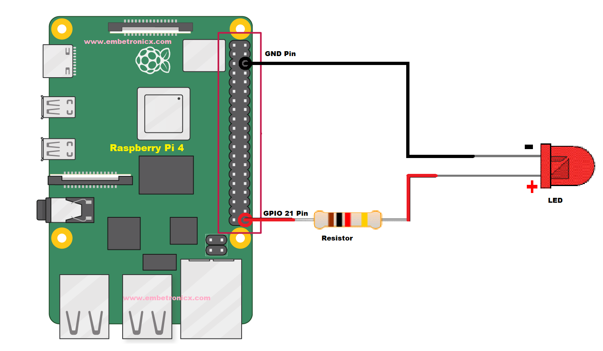

# Building Android App Control Gpio
## General Notes
This instruction will help you understand how to access hardware layer from application layer.<br>
Prerequisites:<br>
- You have to build AOSP for rpi4 before go to this instruction
- LEDs, a breadboard and some buses
- You also need some ingredient, download it at HERE.

## Creating driver LED
### Creating driver source code
First of all, you need to build a driver for controlling your LED.<br>
Thanks a lot to EmbeTronicX for [LED driver](https://embetronicx.com/tutorials/linux/device-drivers/gpio-driver-basic-using-raspberry-pi/)

### Integrate LED driver to kernel
Create $AOSP/kernel/arpi/drivers/leds/leds-rpi4-demo.c file with content as [this file](https://github.com/Embetronicx/Tutorials/blob/master/Linux/Device_Driver/GPIO-in-Linux-Device-Driver/driver.c)

Apply the below patch to $AOSP/kernel/arpi/ to integrate your driver.
```patch
diff --git a/arch/arm64/configs/bcm2711_defconfig b/arch/arm64/configs/bcm2711_defconfig
index 43f7f80a015f..8bc9d1c73865 100644
--- a/arch/arm64/configs/bcm2711_defconfig
+++ b/arch/arm64/configs/bcm2711_defconfig
@@ -1260,6 +1260,7 @@ CONFIG_MMC_SPI=m
 CONFIG_LEDS_CLASS=y
 CONFIG_LEDS_PCA9532=m
 CONFIG_LEDS_GPIO=y
+CONFIG_LEDS_RPI4_DEMO=y
 CONFIG_LEDS_PCA955X=m
 CONFIG_LEDS_PCA963X=m
 CONFIG_LEDS_IS31FL32XX=m
diff --git a/drivers/leds/Kconfig b/drivers/leds/Kconfig
index 1988de1d64c0..f092cde74693 100644
--- a/drivers/leds/Kconfig
+++ b/drivers/leds/Kconfig
@@ -315,6 +315,15 @@ config LEDS_GPIO
          defined as platform devices and/or OpenFirmware platform devices.
          The code to use these bindings can be selected below.
 
+config LEDS_RPI4_DEMO
+       tristate "LED Support for GPIO RPI4 connected LEDs"
+       help
+         This option enables support for the LEDs connected to GPIO
+         outputs. To be useful the particular board must have LEDs
+         and they must be connected to the GPIO lines.  The LEDs must be
+         defined as platform devices and/or OpenFirmware platform devices.
+         The code to use these bindings can be selected below.
+
 config LEDS_LP3944
        tristate "LED Support for N.S. LP3944 (Fun Light) I2C chip"
        depends on LEDS_CLASS
diff --git a/drivers/leds/Makefile b/drivers/leds/Makefile
index 41fb073a39c1..9c67ae07082d 100644
--- a/drivers/leds/Makefile
+++ b/drivers/leds/Makefile
@@ -31,6 +31,7 @@ obj-$(CONFIG_LEDS_SUNFIRE)            += leds-sunfire.o
 obj-$(CONFIG_LEDS_PCA9532)             += leds-pca9532.o
 obj-$(CONFIG_LEDS_GPIO_REGISTER)       += leds-gpio-register.o
 obj-$(CONFIG_LEDS_GPIO)                        += leds-gpio.o
+obj-$(CONFIG_LEDS_RPI4_DEMO)   += leds-rpi4-demo.o
 obj-$(CONFIG_LEDS_LP3944)              += leds-lp3944.o
 obj-$(CONFIG_LEDS_LP3952)              += leds-lp3952.o
 obj-$(CONFIG_LEDS_LP55XX_COMMON)       += leds-lp55xx-common.o
```
As you can see, this driver will be loaded with the system.

### Rebuild kernel
```bash
$ cd $AOSP/kernel/arpi
$ ARCH=arm64 scripts/kconfig/merge_config.sh arch/arm64/configs/bcm2711_defconfig kernel/configs/android-base.config kernel/configs/android-recommended.config
$ ARCH=arm64 CROSS_COMPILE=aarch64-linux-gnu- make Image.gz -j14
$ ARCH=arm64 CROSS_COMPILE=aarch64-linux-gnu- DTC_FLAGS="-@" make broadcom/bcm2711-rpi-4-b.dtb
$ ARCH=arm64 CROSS_COMPILE=aarch64-linux-gnu- DTC_FLAGS="-@" make overlays/vc4-kms-v3d-pi4.dtbo
```

### Rebuild AOSP and Write image to sdcard
```bash
$ cd $AOSP
$ make ramdiskimage vendorimage systemimage -j14
$ ./scripts/android_flash_rpi4.sh sdb #suppose your sdcard is sdb
```

After building, flashing you need to test your driver working as expected.<br>
Preparing hardware like the below photo <br>
Make sure your rpi4 connected to the internet.<br>
Connect to your rpi4 through adb protocol:
```bash
$ adb connect <IP_ADDRESS>:5555
$ adb shell
```
After establishing the connection to rpi4, just run the below command to test your driver:
```bash
rpi4:/ # echo 1 > /sys/class/gpio/gpio21/value
rpi4:/ # echo 0 > /sys/class/gpio/gpio21/value
rpi4:/ # cat /sys/class/gpio/gpio21/value
```

## Integrate GpioControl to AOSP
### Clone GpioControl app
Change directory to $AOSP/packages/apps and clone GpioControl app:
```bash
$ cd $AOSP/packages/apps
$ git clone https://github.com/nguyenanhgiau/GpioControl.git -b rpi4-a11-telephony GpioControl
```

This app uses jni library for controlling gpio on rpi4.<br>
You have to aware there are some differences among android versions.<br>
Therefore, you need to modify Android.mk fit to it.<br>
This Makefile is for android-11.

### Integrate GpioControl
```patch
diff --git a/rpi4.mk b/rpi4.mk
index 1469e00..06beca5 100644
--- a/rpi4.mk
+++ b/rpi4.mk
@@ -38,7 +38,8 @@ PRODUCT_SOONG_NAMESPACES += external/mesa3d
 
 # application packages
 PRODUCT_PACKAGES += \
-    Launcher3
+    Launcher3 \
+    GpioControl
 
 # system packages
 PRODUCT_PACKAGES += \
@@ -51,10 +52,11 @@ PRODUCT_PACKAGES += \
     audio.a2dp.default \
     audio.r_submix.default \
     wificond \
     wpa_supplicant \
     wpa_supplicant.conf \
-    libbt-vendor
+    libbt-vendor \
+    libgpio-control-hal \
+    gpio-control-test
 
 # hardware/interfaces
 PRODUCT_PACKAGES += \
```

### Change permission for your LED driver
Apply the below path to $AOSP/device/arpi/init.rpi4.rc
```patch
diff --git a/init.rpi4.rc b/init.rpi4.rc
index 891c778..6d03ef3 100644
--- a/init.rpi4.rc
+++ b/init.rpi4.rc
@@ -17,6 +17,9 @@ on post-fs-data
     chown bluetooth bluetooth /sys/class/rfkill/rfkill0/state
     chown bluetooth bluetooth /sys/class/rfkill/rfkill0/type
 
+    chmod 0666 /sys/class/gpio/gpio21/value
+    chmod 0666 /dev/etx_device
+
     # Set indication (checked by vold) that we have finished this action
     setprop vold.post_fs_data_done 1
```

### Rebuild AOSP:
```bash
$ make ramdiskimage vendorimage systemimage -j14
$ ./scripts/android_flash_rpi4.sh sdb #suppose your sdcard is sdb
```

After building, flashing and connecting, you need to test your libraries:
```bash
rpi4:/ # which gpio-control-test
/system/bin/gpio-control-test
rpi4:/ # which gpio-control-hal.so
1|rpi4:/ # ls /system/lib | grep gpio
ls: /system/lib: No such file or directory
1|rpi4:/ # ls /system/lib64/ | grep gpio                                                                                                         
libgpio-control-hal.so
libgpio-control-jni.so
rpi4:/ # ls /system/lib*/ | grep gpio                                                                                                            
libgpio-control-hal.so
libgpio-control-jni.so
```

Open GpioControl app and enjoy your effort.

**Thank you so much to VAT for this knowledge!!!**<br>
**HAVE FUN!**
